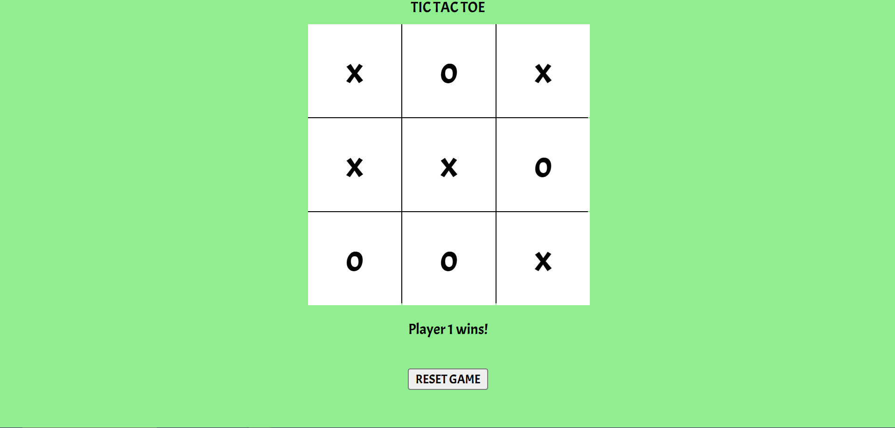

# Tic Tac Toe

Link to project: ((https://tictacobject.netlify.app/))

## How It's Made:
Tech used: HTML, CSS, JS

This application emphasizes object-oriented programming to create the entirety of the tic-tac-toe game. The game itself is constructed as an instance of an object from the TicTacToe class in JS. 

## Optimizations

Initially I had created the entire game using just functional programming, but decided to go back and make the entire a game an object to clean up the code.

## Lessons Learned

The most important lesson I learned from this is when adding event listeners to objects, it is important to use the 'this' keyword to bind the event listeners to the instance of the object, so that they are not bound to the window object. Having the event listeners without binding them to the window object was causing the site to break. 

